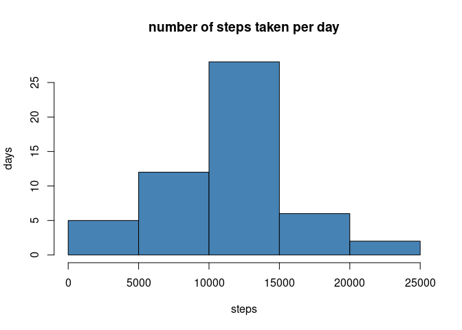
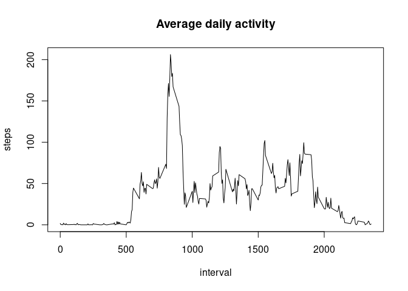
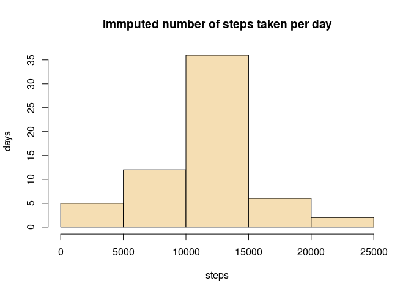
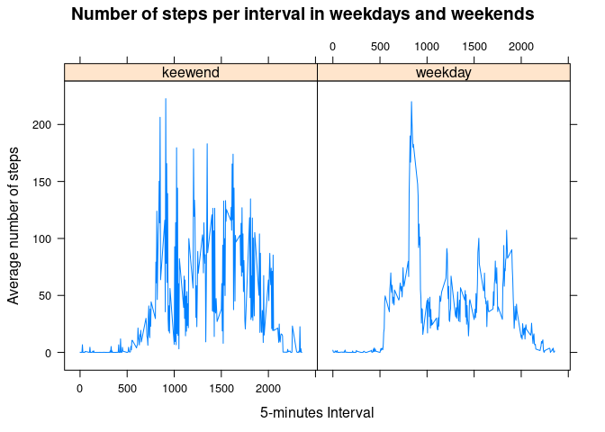

## Loading and preprocessing the data

Just load the data using *read.csv* command.

```r
data<-read.csv("activity.csv")
```

## What is mean total number of steps taken per day?

we create a data subset that doesn't have NAs, and then using the *aggregate* function  
obtain the total steps taken per day.

```r
steps_na<-subset(data, !is.na(data$steps))
steps_day<-aggregate(steps~date,steps_na, sum, na.rm=TRUE)
```
we create the histogram with the steps variable of the aggregated set


```r
hist(steps_day$steps, main = "number of steps taken per day", xlab = "steps", ylab = "days", col="steelblue")
```

<!-- -->

now, we obtain the average with the *mean()* function that give us: **1.0766189\times 10^{4}** and the median with the function *median()* which give us: **10765**.

## What is the average daily activity pattern?

using *aggregate* we obtain the average total steps accordingly to intervals, the plot it using a *type="l"*.

```r
step_int_mean<-aggregate(steps~interval,steps_na, mean, na.rm=TRUE)
with(data = step_int_mean, plot(interval,steps,type = "l", main="Average daily activity"))
```

<!-- -->

we could obtain the 5-minute interval using *max()* function, that give us: **2355**.

## Imputing missing values
fist of all we can know the number of total missing values by runing the next command:

```r
sum(is.na(data$steps))
```

```
## [1] 2304
```

Now we can create a set with the average total steps accordingly to its unique values of intervals, which are the same each day, after that we create a function to replace the NA value of the step in the intervals that are equals by the step mean of the same interval.


```r
#using intervals is possible to have in count those that are NAs, that doesn't happen with dates.
interval_mean<-aggregate(steps~interval, data=data, mean, na.rm=TRUE)

#we copy the original data in a new variable where the changes gonna happen
imputed<-data
#create a function that search for the mean value according the interval
imp<-function(intervals){
  imputed[which(imputed$interval == intervals & is.na(imputed$steps)),]$steps <<- interval_mean[which(interval_mean$interval == intervals),]$steps
}
```
we use the function created with *lapply* so it will replace the intervals whose steps are NAs

```r
lapply(interval_mean, imp)
```
Now, we recalculate the new total steps per day

```r
newImp<-aggregate(steps~date, data=imputed, sum)
```
and, plot the histogram

```r
hist(newImp$steps, main = "Immputed number of steps taken per day", xlab = "steps", ylab = "days", col="wheat")
```

<!-- -->

now, obtaining again the average with the *mean()* function give us: **1.0766189\times 10^{4}** and the median with the function *median()* which give us: **1.0766189\times 10^{4}**. thus, the mean value is the same as swhon before, but the median value has changed.

## Are there differences in activity patterns between weekdays and weekends?

the first step is to become the date column in format *Date*, then we create a knew column called *kindday* with the value *"weekday"* to all rows, after that we change the value of the weekend days for *"weekend"*, finally we transform the column to *factor*.


```r
#transform to Date format
imputed$date<-as.Date(imputed$date, "%Y-%m-%d")
#create the kindday column
imputed$kindday<-"weekday"
#filter and give the weekend value when corresponding.
imputed$kindday[which(weekdays(imputed$date)==c("sábado","domingo"))]<-"keewend"
#transform the kindday to factor
imputed<-transform(imputed, kindday=factor(kindday))
```

we create the set for the average of the steps by interval and having in count the kindday. Then plot it by kindday as shown next.


```r
#aggregate at a subset to obtain the mean of steps per interval and kindday
kindday_activity<-aggregate(steps~interval+kindday, imputed, mean )
#plotting
library(lattice)
xyplot(steps ~ interval | kindday, data = kindday_activity,type="l", layout(c(1,2)), xlab = "5-minutes Interval", ylab = "Average number of steps", main= "Number of steps per interval in weekdays and weekends")
```

<!-- -->
